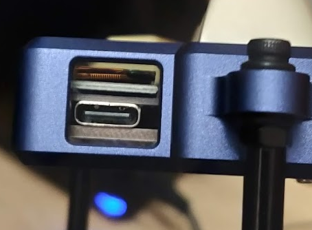
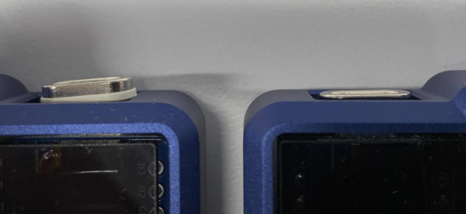
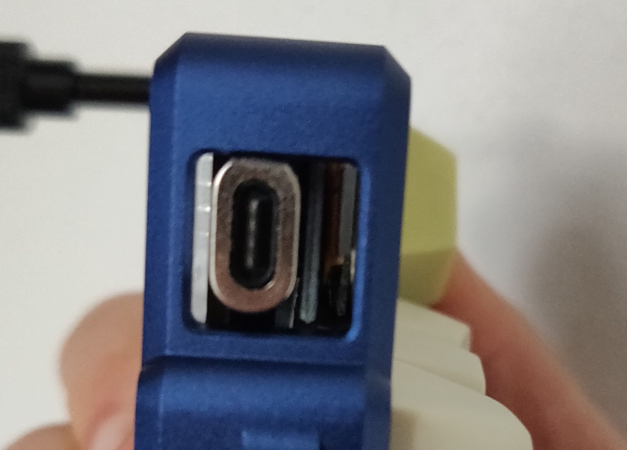
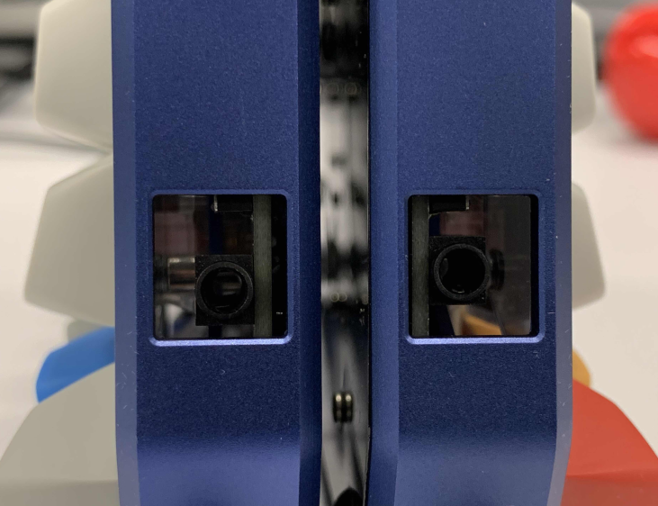
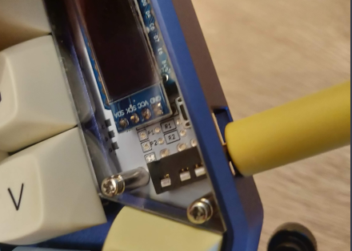
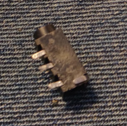
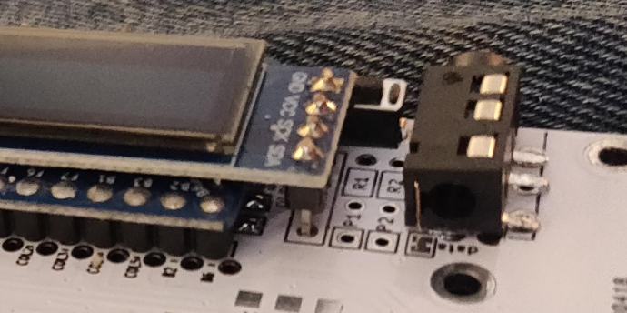
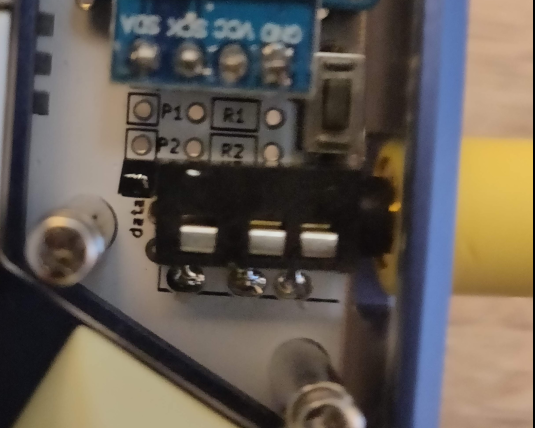
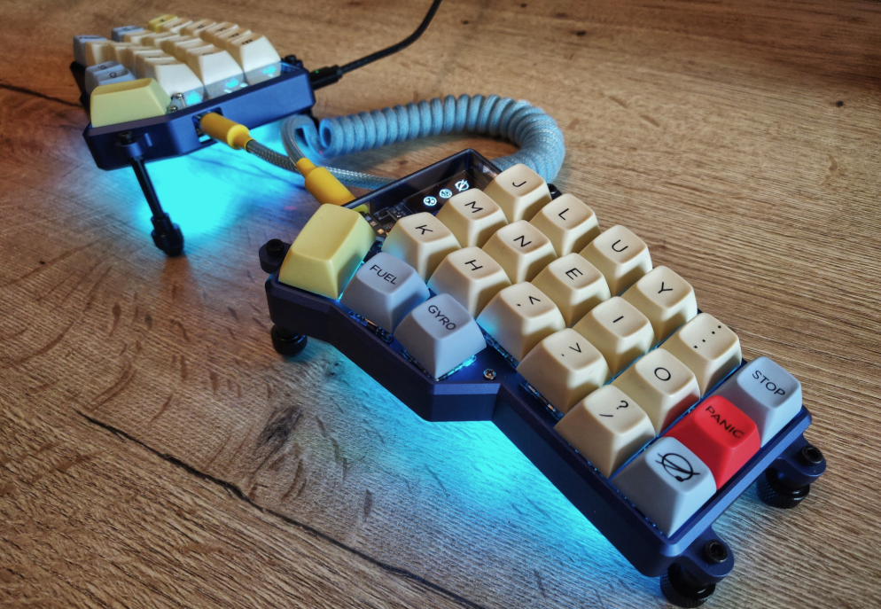

# IMK Corne case fixes

This is a README file to address IMK Corne case issues and how to fix them.

## What's the problem?

The [Corne keyboard (crkbd)](https://github.com/foostan/crkbd) PCB is designed to be mirrored. As a result the MCU (pro micro or Elite C usually) sits sligthly more to the right on the left half of the board and the TRRS jack sits slightly lower. Normally this isn't a problem.

The [aluminium case designed by IMKulio](https://imkulio.com/) is designed for the right half of the board and then mirrored. For aforementioned reasons this does not work out well.

### The MCU port

#### The problem

The MCU port causes issues with Elite C specifically. I think the pro micro is okay.

The problem is when your USB C cable is somewhat thicker right after the connector. Personally I use cheap magnet cables so I can easily switch halves around when flashing or moving the keyboard.

The problem looked like this:

#### My solution

The way to solve it was not clean. I simply filed one of the magnet connector sides flat.

Another suggestion is when you are still building your Corne, to shift the the Elite-C to the left as much as possible. You can also use the right half as master instead.

### The TRRS jacks

#### The problem

This problem is more severe in my opinion.

Again, if you use a cable with relatively thin ends before the TRRS pin, you should be fine. Personally I had a custom TRRS cable created and wanted to use it with the board.

#### My solution

This was more involved than I liked, but with the help of the 40s discord I came to the solution to slightly shift the jack up.

First I desoldered the jack, filed off the little plastic nubs, then bent the pins backwards.

The result:

 

I put electrical tape over the upper TRRS connectors meant for the flip side, so the jack wouldn't touch those. Then I glued the jack to the board and fitted it with electrical tape.

I flowed solder into the holes from underneath, then connected it from the top.

In hindsight I didn't even need to move it as much as I did. I think I moved it about 4mm and 2mm would have been sufficient.

The result:

 

### The OLED cover plates

#### The problem

On some keycap profiles the inner keys will hit or scratch against the acrylic OLED plates.

This is most noticeable with SA and was also noticeable to me with MT3.

#### My solution

I simply filed down the inner edge of the plates. The edge does get cloudy instead of transparent, but that's not noticeable when viewing from the top.

Still, here's a tip from **dmatx** from the 40s Discord:

> use gradually finer sandpaper in multiple rounds up to 1000-1200 grit combined with wet sanding to achieve transparency

Another option is to have them cut by a local shop them and reduce the size by 1-2mm. The IMK files are in the [repo](https://github.com/foostan/crkbd/tree/master/case/acrylic_plate/imk).

## End result

 

## Conclusion and thoughts

I hope this helps anyone running into these issues.

Finally, I want to say thanks to the smooth GB and making a high quality case, but I really hope these points are being taken into consideration. To me it's surprising these issues were not caught during the prototyping.
